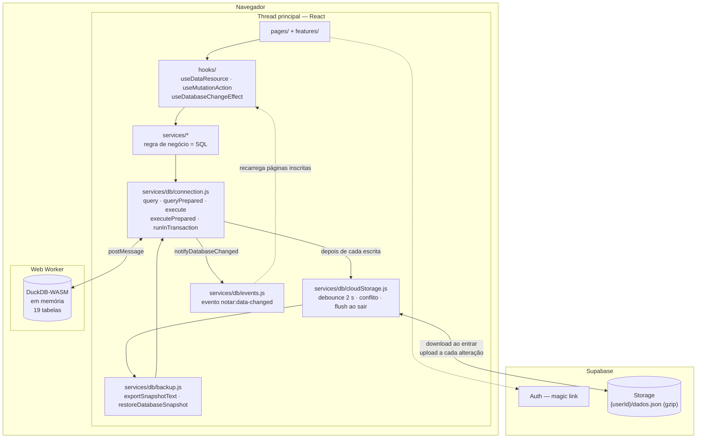
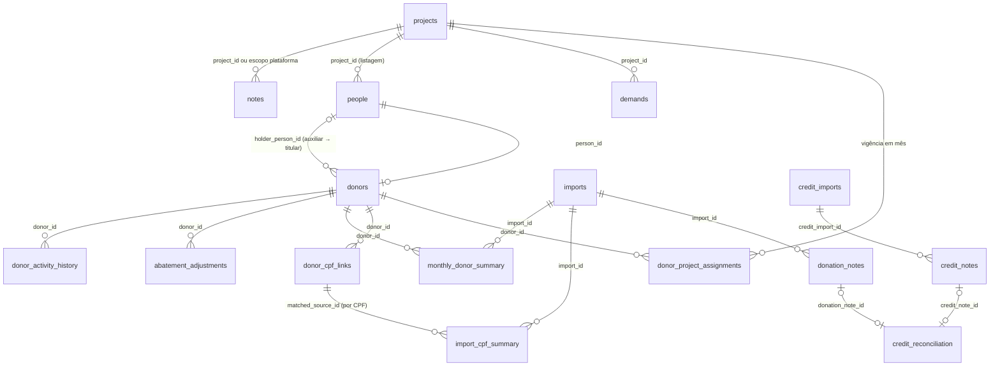

# Notar — guia do código

> Escrito em 01/10/2026 contra o commit 299 (`ee9d06e`), depois de uma leitura
> de reconhecimento do repositório. O objetivo é que outro engenheiro — ou
> outra sessão, sem memória desta — fique produtivo lendo só este arquivo.
>
> Complementa, não substitui: o `README.md` explica o produto para quem chega;
> o `CLAUDE.md` é o diário de decisões commit a commit; o `DIAGNOSTICO.md`
> lista o que está errado ou arriscado hoje.

**Como ler as afirmações deste arquivo.** O que está sem marca foi conferido no
código. O que vem marcado com *(doc)* foi tirado do README/CLAUDE.md e não
relido linha a linha. *(suposição)* é inferência minha e está repetida na lista
de perguntas do `DIAGNOSTICO.md`. A seção 12 diz exatamente o que foi lido.

---

## 1. O que é e para que serve

O Notar é a ferramenta de trabalho de uma ONG que arrecada pela **Nota Fiscal
Paulista (NFP)**. Pessoas doam suas notas fiscais para a entidade; a NFP
converte essas notas em crédito para a ONG e publica, todo mês, duas planilhas:

- **Doações** — quais notas foram doadas, por qual CPF.
- **Créditos** — quanto cada nota efetivamente rendeu.

Com isso a equipe da ONG precisa, todo mês:

1. saber **quem doou quantas notas** (por CPF, agrupando família: titular e auxiliares);
2. calcular o **abatimento** de cada doador (`notas válidas × valor por nota`);
3. **conferir** doações contra créditos, nota a nota;
4. gerar a **planilha de abatimento** que um sistema externo importa para dar baixa;
5. marcar o que já foi abatido e acompanhar o que ficou pendente.

O domínio de origem é moradia ("Demandas de Moradia" é o projeto padrão), mas
o sistema virou uma plataforma com vários **projetos** sobre a mesma base de
notas.

**Sucesso, para quem usa:** fechar o mês sem planilha paralela — importar os
dois arquivos, ver quem doou, exportar a planilha de abatimento no formato
exato do sistema de baixa e não abater a mesma doação duas vezes. E conseguir
fazer isso em mais de um computador sem perder trabalho.

*(suposição)* "Abatimento" é um desconto concedido ao doador em algo que ele
paga à entidade; o código só conhece o valor e o destino (um sistema externo
que importa um "extrato"), não o que é abatido.

---

## 2. Stack real

| Camada | Tecnologia | Versão instalada |
|---|---|---|
| UI | React + React DOM | 19.2.5 |
| Roteamento | react-router-dom (`BrowserRouter`) | 7.18.3 |
| Build/dev | Vite + `@vitejs/plugin-react` | 8.2.2 / 6.0.1 |
| Estilo | Tailwind CSS 4 via `@tailwindcss/vite`, tokens em CSS vars | 4.2.2 |
| Banco | **DuckDB-WASM** (bundle EH), em memória, num Web Worker | 1.33.1-dev45.0 (DuckDB 1.5.1) |
| Nuvem | Supabase — **só** Auth (magic link) e Storage (um blob) | supabase-js 2.105.4 |
| Planilhas | exceljs (leitura de XLSX, escrita da planilha de abatimento) | 4.4.0 |
| Animação / ícones | framer-motion / lucide-react | 12.38.0 / 1.9.0 |
| Ids | nanoid | 5.1.16 |
| Lint | ESLint 9 (flat config) + react-hooks + react-refresh | 9.39.4 |
| Testes | `node --test` (unit + integração com DuckDB no Node) e Playwright | Node 24 local, 22 no CI / 1.59.1 |

Linguagem: **JavaScript puro** (JSX, ES modules). Não há TypeScript — decisão
registrada e adiada.

**Não existe backend próprio.** Não há API, servidor, Docker nem banco
relacional hospedado. Toda regra de negócio é SQL executado no navegador.

Serviços externos tocados em tempo de execução:

| Serviço | Para quê | Observação |
|---|---|---|
| Supabase Auth | login por magic link | sessão em `localStorage` |
| Supabase Storage | um objeto por usuário: `{userId}/dados.json` (gzip) | bucket privado `notar` |
| `extensions.duckdb.org` | DuckDB baixa a extensão `json` em toda sessão | dependência não documentada — ver DIAGNOSTICO S8 |
| Google Fonts | fonte Geist | `index.html` |

---

## 3. Como rodar

Pré-requisitos: Node ≥ 20 (CI usa 22) e npm.

```bash
npm install          # o postinstall copia o worker do DuckDB para src/vendor/
cp .env.example .env # preencher com o projeto Supabase
npm run dev          # http://localhost:5173
```

| Comando | O que faz | Estado em 01/10/2026 |
|---|---|---|
| `npm run dev` | servidor Vite | ok |
| `npm run build` | build de produção em `dist/` | ok (1,5 s) |
| `npm run lint` | ESLint | 0 erros, 0 avisos |
| `npm test` | 36 arquivos, 259 testes (`node --test`) | 259/259, ~105 s |
| `npm run test:e2e` | 40 specs Playwright (Chromium) | ver seção 10 |

Variáveis (`.env`, nunca versionado):

```
VITE_SUPABASE_URL=            VITE_SUPABASE_STORAGE_BUCKET=notar
VITE_SUPABASE_ANON_KEY=       VITE_SUPABASE_STORAGE_OBJECT=dados.json
VITE_NOTAR_AUTH_MODE=         # "local" = sem login, sem nuvem, tudo em memória
```

**`VITE_NOTAR_AUTH_MODE=local` desliga a persistência inteira.** É o modo da
suíte e2e (`playwright.config.js` injeta a variável). Com ele o banco some a
cada recarga. Se o app "esquece tudo", é isto.

Setup do Supabase (bucket privado, policy "own folder", e-mail sem
confirmação, redirect URLs) está no README, seção "Configuração de ambiente".

---

## 4. Mapa de pastas

```
src/
├── main.jsx                 entrada: instala handlers globais de erro, monta <AuthProvider><App/>
├── App.jsx                  portão: sessão → hidratação da nuvem → rotas
├── routes/                  AppRoutes (todas as rotas) + redirect de rotas antigas
├── pages/                   uma por rota — estado, carregamento, handlers (16 arquivos, ~6,9k linhas)
├── features/<domínio>/      componentes e hooks de UM domínio (96 arquivos, ~15,7k linhas)
│     credits  dashboard  demands  donors  history  imports
│     monthly  notes  notesAnalytics  people  projects  reports
├── components/
│   ├── ui/                  primitivos (Button, Modal, DataTable, SelectInput, MetricValue…)
│   ├── layout/              Layout, Sidebar, navigation.js (definição do menu), PageTransition
│   ├── auth/                SignInPanel
│   ├── project/             ProjectGate (guarda das rotas /p/:slug)
│   └── sync/                RemoteConflictBanner
├── contexts/                AuthContext, ProjectContext (+ arquivos *ContextValue.js)
├── hooks/                   useDataResource, usePaginatedResource, useMutationAction,
│                            useDatabaseChangeEffect, useCloudSync, useHiddenValues…
├── services/                TODA a regra de negócio e o acesso a dados (87 arquivos, ~20k linhas)
│   ├── db.js                barril da camada de banco (e registra o hook de sync)
│   ├── db/                  connection, migrations, schema, backup, cloudStorage, events, sql…
│   ├── import/              planilha de doações: prévia, processamento, reimportação, exclusão
│   ├── credit/              planilha de créditos (mesmo ciclo)
│   ├── reconciliation/      motor da conciliação + consultas derivadas
│   ├── monthly/             apuração mensal, abatimento, planilha de abatimento, inatividade
│   ├── donor/               cadastro, checagens, perfil, histórico, início das doações
│   ├── project/             SQL do vínculo doador→projeto
│   ├── dashboard/  notes/  establishment/  raffle/     SQL puro de cada painel
│   └── *Service.js          fachadas por domínio (vários são barris de 20–90 linhas)
├── utils/                   funções puras: cpf, date, format, mask, csv, import, backup…
├── constants/               opções de filtro compartilhadas
├── styles/index.css         tokens de design + Tailwind
└── vendor/duckdb/           worker EH do DuckDB, copiado pelo postinstall e versionado

tests/     node:test — puros + integração real contra DuckDB no Node (helpers/duckdbHelper.js)
e2e/       Playwright — fluxos no navegador; fixtures em e2e/fixtures (backups JSON e CSVs)
scripts/   prepare-duckdb-worker.mjs (postinstall)
docs/      capturas usadas no README
.github/   CI: job `checks` (lint+test+build) e job `e2e` (Chromium)
```

Regra de dependência: `pages → features → components/ui`, e todos →
`hooks`/`services`/`utils`. `services` nunca importa de `pages`/`features`.
`utils` não importa de ninguém.

---

## 5. Pontos de entrada

**Boot** (`main.jsx` → `App.jsx`):

```
AuthProvider  →  status: loading | authenticated | unauthenticated | local
   authenticated   → <CloudSyncGate>   hidrata da nuvem, depois monta as rotas
   local           → <LocalAppShell>   rotas direto, banco vazio em memória
   unauthenticated → <SignInPanel>     formulário de magic link
```

**Rotas** (`src/routes/AppRoutes.jsx`):

| Rota | Página | Escopo |
|---|---|---|
| `/` | `Projects` — escolha de projeto | plataforma |
| `/p/:slug` | `Dashboard` | projeto |
| `/p/:slug/doadores` · `/doadores/:donorId` | `Donors` · `DonorProfile` | projeto |
| `/p/:slug/mensal` | `Monthly` — Gestão Mensal (módulo `monthly`) | projeto |
| `/p/:slug/pessoas` · `/demandas` | `People` · `Demands` (módulos `people`/`demands`) | projeto |
| `/p/:slug/sorteio` | `Raffle` — números da sorte (módulo `monthly`) | projeto |
| `/p/:slug/anotacoes` | `Notes` | projeto |
| `/plataforma` | `PlatformDashboard` | plataforma |
| `/plataforma/notas` | `PlatformNotes` — inteligência sobre notas fiscais | plataforma |
| `/plataforma/anotacoes` | `Notes` com `PLATFORM_NOTES_SCOPE` | plataforma |
| `/importacoes` | `Imports` — doações **e** créditos | plataforma |
| `/lixeira` · `/historico` · `/configuracoes` | `Trash` · `ActionHistory` · `Settings` | conta |
| `/doadores`, `/mensal`, `/pessoas`, `/demandas`, `/anotacoes` | `LegacyProjectRedirect` → primeiro projeto | legado |
| `/creditos` | redirect para `/importacoes` | legado |

O menu é definido em `components/layout/navigation.js`; `ProjectGate` usa a
mesma lista para barrar rota de módulo desligado.

**Não há** jobs agendados, CLI, webhooks nem endpoints. Os únicos gatilhos
automáticos são eventos do navegador registrados em `services/db/cloudStorage.js`
(`visibilitychange`, `pagehide`, `beforeunload`, `focus`).

---

## 6. Arquitetura



**As quatro ideias que sustentam tudo:**

1. **O banco é efêmero; o blob é a verdade.** O DuckDB nasce vazio a cada
   carregamento de página. `initDB()` cria o worker, roda as 16 migrations e
   as normalizações; `hydrateFromCloud()` baixa o snapshot e o reinsere inteiro.
   Não há OPFS nem IndexedDB — recarregar a página é refazer tudo isso.

2. **Toda escrita agenda um upload do banco inteiro.** `execute`,
   `executePrepared` e `runInTransaction` chamam `flushAfterTransaction()`, que
   é `scheduleCloudFlush()` (registrado por efeito colateral de importar
   `services/db.js`). Dois segundos depois da última escrita, o banco inteiro é
   serializado, comprimido e enviado com `upsert`.

3. **As páginas reagem a eventos, não a retorno de chamada.** Depois de uma
   escrita, `notifyDatabaseChanged({ source, domains })` dispara
   `notar:data-changed`. Páginas se inscrevem com
   `useDatabaseChangeEffect(reload, { domains | sources | ignoreSources })`.

4. **Uma conexão só, uma transação por vez.** `runInTransaction` usa um
   contador de profundidade: quem chama com uma transação já aberta **entra
   nela** em vez de abrir outra (o DuckDB não aninha). Dentro de transação,
   nenhuma escrita dispara flush nem evento; isso acontece uma vez no COMMIT.

**Contexto global fora do React** (mesmo padrão, dois lugares):
`setActiveCloudUser(userId)` em `cloudStorage.js` e `setActiveProjectId(id)` em
`services/activeProject.js`. Os serviços leem o projeto ativo desse holder em
vez de recebê-lo por parâmetro. O `ProjectProvider` o escreve **durante o
render** e limpa o `queryCache` na troca.

**Camadas de leitura na UI:**

- `useDataResource({ loader, filters, neutralizedKeys, countLoader })` — carga
  com descarte de resposta atrasada, debounce de filtro (180 ms), `isLoading`
  vs `isRefreshing`, erro via `logError`.
- `usePaginatedResource` — o anterior + paginação no SQL (`limit`/`offset` + `count*`).
  Usado em Doadores, Pessoas, Lixeira, Histórico e Notas fiscais. Gestão
  Mensal, Demandas e Sorteio paginam no cliente.
- `useMutationAction` — executa mutação, recarrega, mostra sucesso/erro e
  monta o "Desfazer".

---

## 7. Modelo de dados

19 tabelas, criadas por `services/db/migrations.js` (v1–v16, registradas em
`schema_version`). **Não há PRIMARY KEY nem FOREIGN KEY**: a identidade é
garantida por `CREATE UNIQUE INDEX` (o DuckDB-WASM não aceita `ADD PRIMARY KEY`
em tabela com dados) e a integridade referencial é responsabilidade do código.



### Cadastro

| Tabela | O que é | Notas |
|---|---|---|
| `projects` | Um ambiente de trabalho. `modules` é JSON em texto com os módulos ligados. | Padrão: `prj-demandas-moradia`. Slug único. |
| `donor_project_assignments` | Vínculo doador→projeto com vigência `valid_from`/`valid_to` **em mês**. | Sentinelas `1900-01-01` e `9999-12-01` em vez de NULL (DuckDB não tem índice único parcial). Único em `(donor_id, valid_to)` = um vínculo aberto por doador. |
| `demands` | Subdivisão de um projeto (ex.: um grupo atendido). | Única por `(project_id, name)`. |
| `people` | Pessoa física (nome + CPF). CPF único **global**. | `project_id` só define em que projeto ela é listada. |
| `donors` | Papel de doador de uma pessoa. `donor_type`: `holder` (titular) ou `auxiliary`. | `demand` guarda o **nome** da demanda, não o id. CPF único. Auxiliar aponta para o titular por `holder_person_id`. |
| `donor_cpf_links` | CPFs pelos quais um doador doa. É por aqui que nota vira doador. | Coluna-chave de toda junção com planilha. |

### Importação de doações

| Tabela | O que é |
|---|---|
| `imports` | Uma planilha de doações. **Uma por mês de referência** (regra em `createImportRecord`). Guarda `value_per_note` e `status` (`processing`/`processed`/`error`). |
| `donation_notes` | Uma linha por nota doada: CPF, CNPJ do estabelecimento, número, valor, datas, `status_pedido`, `is_valid`, `match_key`, `valor_cents`. |
| `import_cpf_summary` | Agregado por `(importação, CPF)`: notas válidas, inválidas, e a qual doador o CPF casou. |
| `monthly_donor_summary` | **Tabela derivada.** Uma linha por `(importação, doador)`: notas, valor por nota, `abatement_amount`, `abatement_status` (`pending`/`applied`). Guarda **cópias** de nome, CPF e demanda. |
| `abatement_adjustments` | "Acumulado": um lançamento que cobre um intervalo de meses e é abatido num mês só. Único por `(doador, mês)`. |

### Créditos e conciliação

| Tabela | O que é |
|---|---|
| `credit_imports` | Uma planilha de créditos por mês. |
| `credit_notes` | Uma linha por crédito: CNPJ, `emitente` (única fonte do nome do estabelecimento), número, valor da NF, `credito`, `situacao`, `is_valid` (`calculado` ou `liberado`). |
| `credit_reconciliation` | **Tabela derivada**, reconstruída inteira a cada conciliação. `match_status`: `matched`, `divergent`, `credit_only`, `donation_only`, `duplicate_credit`, `duplicate_donation`. |

### Apoio

`notes` (anotações ricas, por projeto ou da plataforma), `action_history`
(auditoria **e** log de erros: `action_type = 'error'`), `donor_activity_history`
(ativação/desativação por mês), `trash_items` (lixeira: `payload_json` com o
que é preciso para restaurar), `schema_version`.

### Regras de negócio que o schema não mostra

- **Chave de conciliação.** `match_key = <cnpj só dígitos>|<número sem zeros à
  esquerda>`. `valor_cents` (inteiro) decide entre `matched` (igual) e
  `divergent` (diferente). A **data não entra** — as duas planilhas divergem
  nela. Chave repetida de um lado vira `duplicate_*` e **não pareia**.
- **Só linha válida conta.** Doação: `is_valid = NOT (status casa com
  INVALID_ORDER_STATUS_PATTERNS)` de `utils/import.js`. Crédito: `situacao`
  normalizada ∈ {`calculado`, `liberado`}.
- **O projeto é dimensão, não partição.** Nenhuma tabela de importação/nota/
  conciliação tem `project_id`. O projeto de uma nota é o do vínculo vigente
  **no mês da nota** (`assignmentJoin`, `donorBelongedToProjectAtMonth` em
  `services/project/projectAssignmentSql.js`). Invariante testado:
  `Σ(por projeto) + Σ(não atribuído) = Σ(conciliado)`.
- **Titular × auxiliar.** Cada um tem cadastro, CPF e linha própria no resumo
  mensal. Na **planilha de abatimento** a linha do auxiliar sai com nome e CPF
  do **titular**, e a descrição diz de quem são as notas.
- **Acumulado cobre meses.** Um mês dentro do intervalo de um acumulado
  lançado em outro mês aparece como "Via acumulado": fica fora dos totais e
  não pode ser marcado sozinho (`markSubsumedRows`, `filterOutSubsumedIds`).
- **Datas são mês.** Mês de referência é sempre o dia 1 (`startOfMonth`).
  Atenção: quem recebe `"2026-03"` precisa completar o dia antes de
  `CAST(? AS DATE)` (já causou regressão — commit 295).
- **CPF** é guardado só com dígitos; nomes em maiúsculas, com acento.
- **Normalizações rodam em todo boot e todo restore**
  (`services/db/schema.js → applyDataNormalizations`): convertem modelos antigos
  (auxiliar como link → auxiliar como doador), recalculam `matched_*`, garantem
  projeto padrão, vínculos e projeto de demandas/pessoas/anotações. É o que
  torna backups antigos importáveis.

---

## 8. Fluxos principais

### 8.1 Abrir o app (hidratação)

```
AuthProvider.getSession()                                   contexts/AuthContext.jsx
└─ App → CloudSyncGate → useCloudSync()                     hooks/useCloudSync.js
   └─ hydrateFromCloud(userId, { onProgress })              services/db/cloudStorage.js
      ├─ initDB(): Worker + WASM + migrations v1..v16 + normalizações   db/connection.js, schema.js
      ├─ downloadSnapshotFromCloud(): storage.download → gunzip → JSON.parse
      │     404 = primeiro uso; QUALQUER outro erro propaga (isObjectNotFoundError)
      ├─ fetchServerVersion(): storage.list → updated_at vira a "âncora"
      └─ restoreDatabaseSnapshot(snapshot)                   db/backup.js
            DELETE de 18 tabelas → INSERT em blocos de 500 linhas (prepared)
            → runStructuralReload() (normalizações de novo)
   └─ setActiveCloudUser(userId)   ← só agora uploads passam a ser permitidos
   └─ notifyDatabaseChanged({ source: "cloud-hydrate" })
```

A barra "Restaurando notas de doação (8.500 de 30.000 linhas)…" vem do
`onProgress`. **Este é o passo lento do sistema** — ver DIAGNOSTICO S3.

### 8.2 Salvar uma alteração (upload)

```
serviço chama executePrepared / runInTransaction             db/connection.js
└─ flushAfterTransaction() → scheduleCloudFlush()            debounce de 2 s
   └─ uploadSnapshotImmediate(userId)                        db/cloudStorage.js
      ├─ checkForRemoteChanges(): storage.list; se mudou → banner de conflito, upload bloqueado
      └─ performUpload()
         ├─ exportSnapshotText(): 18 SELECTs com json_group_array   db/backup.js, snapshotSources.js
         ├─ compressSnapshot(): gzip via CompressionStream           db/snapshotCodec.js
         ├─ storage.upload(..., { upsert: true })
         └─ fetchServerVersion() de novo para atualizar a âncora
```

Camadas de proteção ao sair: `visibilitychange→hidden` e `pagehide` disparam
flush normal; `beforeunload` tenta `fetch(keepalive)` (limite ~60 KB) e mostra
o prompt nativo. Ao voltar o foco para a aba, `checkForRemoteChanges()` roda de
novo. Não há polling.

### 8.3 Importar a planilha de doações

`pages/Imports.jsx` → `features/imports/hooks/useDonationImportFlow.js` →

```
prepareImportPreview(file)                                   services/import/importProcess.js
├─ XLSX? exceljs → CSV (primeira aba com conteúdo)           import/spreadsheetSource.js
├─ registerFileText("<nanoid>.csv", texto)   nome interno, nunca o nome do usuário
├─ DESCRIBE + LIMIT 5 via read_csv_auto(all_varchar)
└─ detecta colunas: CPF, status do pedido, CNPJ, nº, valor, datas   utils/import.js

processImportedFile({ referenceMonth, cpfColumn, valuePerNote, onProgress })
├─ createImportRecord(status 'processing')   FORA da transação (para o catch marcar 'error')
└─ runInTransaction:
   ├─ populateDonationNotesFromCsv()   INSERT … SELECT direto do CSV    import/donationSpreadsheet.js
   ├─ aggregateCpfCountsFromDonationNotes()
   ├─ saveImportCpfSummary() → reconcileImport()                        import/importRecords.js, importReconcile.js
   │     casa CPF → donor_cpf_links; reconstrói monthly_donor_summary
   │     PRESERVANDO abatement_status de cada doador
   ├─ reconcileCredits()               reconstrói credit_reconciliation  reconciliation/creditReconcileEngine.js
   ├─ backfillDonationStartDates()     preenche início de quem estava sem data
   └─ createActionHistoryEntry()
```

Variações: **reimportar** (`import/importReimport.js`) apaga as notas do mês e
regrava do arquivo novo, com prévia do que muda; **excluir**
(`import/importDelete.js`). Planilha antiga sem `CNPJ Estabelecimento` cai num
caminho legado que só agrega por CPF.

### 8.4 Importar créditos e conciliar

`features/imports/hooks/useCreditImportFlow.js` →
`services/credit/creditImportPipeline.js` (`prepareCreditImportPreview`,
`processCreditImport`, `applyReimportCredit`, `deleteCreditImport`). Mesmo
desenho do 8.3, terminando em `reconcileCredits()`.

`reconcileCredits()` apaga `credit_reconciliation` e insere, **nesta ordem**:
duplicadas de doação → duplicadas de crédito → `matched` → `divergent` →
`credit_only` → `donation_only`. A ordem é a regra: cada passo só pega o que
os anteriores não pegaram (`NOT EXISTS`).

### 8.5 Fechar o mês (Gestão Mensal)

`pages/Monthly.jsx` → `services/monthlyService.listMonthlySummaries()`:

- **um mês** → `monthly/listByMonth.js`: 3 consultas em paralelo (doadores
  ativos do projeto naquele mês, linhas de resumo do mês, importação do mês);
  doador sem linha vira "Sem doações no mês"; depois junta acumulados e marca
  os meses cobertos.
- **nenhum ou vários meses** → `monthly/listHistorical.js`: visão consolidada
  por doador.

Marcar abatimento: `StatusToggle` → `useStatusChangeAction` →
`updateAbatementStatusWithHistory` / `updateAbatementStatusesWithHistory`
(`monthly/abatementUpdates.js`) — UPDATE no resumo + cascata no acumulado do
mesmo `(doador, mês)` + uma linha em `action_history`, tudo numa transação. A
tela aplica o palpite otimista e reverte no erro.

Exportar: `features/monthly/hooks/useMonthlyExports.js` →
`exportAbatementSheetWorkbook` (`services/exportService.js`) →
`monthly/abatementSheet.js` + `abatementSheetSql.js` (uma linha por **CPF**) →
`monthly/abatementSheetWorkbook.js` monta o `.xlsx` no gabarito do sistema de
baixa: parâmetros no topo (`AGENCA 1`, `CONTA 1`, `COD. BANCO NFP2607`),
cabeçalho na linha 6, DATA = último dia do 3º mês após a competência. Um
arquivo por demanda; `.zip` quando há mais de uma. Três recortes: mês único,
meses marcados, e "pendentes" (todos os meses ainda não abatidos).
**Exportar não marca nada como abatido.**

Relatórios PDF/JPEG por demanda: `features/reports/` (renderizador próprio,
sem biblioteca).

### 8.6 Cadastrar e transferir doador

`createDonor` (`services/donor/donorWriter.js`) roda inteiro numa
`runInTransaction`: resolve/cria a pessoa, valida CPF livre
(`ensureDonationCpfIsAvailable`), demanda existente, regras de auxiliar
(`services/donor/donorChecks.js`), insere `donors` + `donor_cpf_links` + vínculo
de projeto. Depois `reconcileImportsForCpfs()` refaz o resumo das importações
em que aquele CPF aparece — é assim que um doador cadastrado depois "ganha" os
meses passados.

`transferDonorToProject` (`services/projectService.js`): fecha o vínculo
aberto no mês anterior ao efetivo, abre o novo, exige demanda do destino
quando o projeto de destino usa demandas, e reconcilia os CPFs. **Não reescreve
o passado**: os meses anteriores continuam no projeto antigo.

Exclusões vão para `trash_items` com payload de restauração
(`services/trashService.js`) e oferecem "Desfazer".

---

## 9. Convenções

**Código**

- JS/JSX, ES modules, aspas duplas, ponto e vírgula, 2 espaços. Sem Prettier
  configurado — o estilo é mantido à mão; siga o arquivo vizinho.
- Componentes em `PascalCase.jsx`, um por arquivo, `export default`. Hooks
  `useX.js`. Serviços e utils em `camelCase.js` com exports nomeados.
- Prefixos de função: `list*` (array), `count*`, `get*` (sempre devolve),
  `find*` (pode devolver `null`), `ensure*` (lança se a regra falha),
  `build*Sql` / `build*Query` (monta SQL, não executa).
- Comentários são longos e explicam **por quê** — quase sempre o bug que a
  linha evita. Os mais antigos estão em inglês, os recentes em português. Texto
  de interface e mensagens de erro: sempre português.
- Sem emojis no código.

**SQL**

- **Todo valor vai por parâmetro** (`queryPrepared`/`executePrepared` com `?`).
  `escapeSqlString` não existe mais no projeto.
- Onde o DuckDB não aceita `?` — identificador, `ORDER BY`, `LIMIT`, argumento
  de `read_csv_auto` — o valor vem de **lista fechada** ou é **gerado
  internamente** (`buildRegisteredFileName`, `NOTE_SORT_COLUMNS`,
  `escapeIdentifier` + checagem contra o `DESCRIBE` do arquivo).
- Ids de projeto são interpolados entre aspas depois de `safeProjectId()`.
- Consulta delicada mora em módulo puro `*Sql.js` (sem imports de banco), para
  o teste de integração rodar **a consulta de produção**. Esses módulos usam
  import com extensão `.js` (o Node não resolve sem).
- Escrita em massa: blocos de 200–500 linhas, tuplas de `?`.
- Mais de uma escrita relacionada → `runInTransaction`, com
  `{ changeSource, changeDomains }`. (`execute`/`executePrepared` usam
  `{ source, domains }` — nomes diferentes, já causou bug silencioso.)

**Erros e logs**

- `logError(scope, error, context)` (`services/logger.js`): console + buffer
  circular de 200 entradas + linha em `action_history`. Nunca lança.
- `installGlobalErrorHandlers()` cobre o que escapar.
- Para o usuário: `getErrorMessage(error, fallback)`; erro de regra de negócio
  é `Error` com mensagem em português (existe `UserFacingError`).
- `console.log` só atrás de `import.meta.env.DEV`.

**UI**

- Cores e sombras por CSS var (`var(--accent)`, `--success-soft`,
  `--data-*`); raios dentro de `@theme`. Tema claro/escuro por classe em `<html>`.
- Foco: `components/ui/focusRing.js`. Rótulo de campo nunca `block` puro (`w-fit`).
- Alvo de toque mínimo 40 px. Modais: prop `onClose`.
- Número é marcado com `.numeric` (é o que o "ocultar valores" mascara).
- Estado derivado de props é ajustado **durante o render**, não em efeito.

**Git**

- Mensagem de commit: `commit N`, sequencial (último: 299). O conteúdo vai no
  diff e no CLAUDE.md.
- Cada commit passa em lint, testes e build.

---

## 10. Testes

| Suíte | Onde | O que cobre |
|---|---|---|
| Unit | `tests/*.test.js` | utils, descrição/datas da planilha de abatimento, decisões de sync, codec do snapshot, busca por texto |
| Integração | `tests/*.test.js` com `helpers/duckdbHelper.js` | migrations reais + as consultas `*Sql.js` contra DuckDB no Node |
| E2E | `e2e/*.spec.js` | fluxos no navegador em **modo local** (sem Supabase) |

Armadilhas conhecidas:

- O harness de integração usa o bundle **MVP** do DuckDB, que quebra em
  `LIKE '%' || ? || '%'` dentro de prepared statement. Nesses casos: teste
  unitário do SQL gerado + validação por e2e.
- **Não rode lint/build junto com o e2e** — a carga provoca timeouts falsos.
- Seletor por nome no Playwright casa por trecho ("Abater em massa" casa com
  "Desabater em massa"): use `exact: true`.
- `MonthlySummaryRow` renderiza cada doador duas vezes (mobile + desktop).
- O restore **não** deriva `import_cpf_summary` das notas: fixture de backup
  precisa trazê-la.
- O e2e exige o Chromium da versão do Playwright instalado
  (`npx playwright install chromium`).

O que **não** tem teste: a orquestração do cloud sync (debounce, upload,
conflito, hidratação) e a importação de planilha de **créditos** por arquivo.

---

## 11. Glossário

| Termo | Significado |
|---|---|
| **NFP** | Nota Fiscal Paulista — programa do Estado de SP que devolve parte do ICMS como crédito. |
| **Nota** | Uma nota fiscal doada. Unidade de tudo. |
| **Doação** | Linha da planilha de doações: uma nota doada por um CPF. |
| **Crédito** | Linha da planilha de créditos: quanto a NFP pagou por uma nota. |
| **Mês de referência / competência** | O mês a que a planilha se refere. Sempre dia 1. |
| **Valor por nota** | Quanto a ONG abate por nota válida naquele mês. Informado na importação. |
| **Abatimento** | `notas válidas × valor por nota`. O que o doador tem a receber de desconto. |
| **Abater / desabater** | Marcar o abatimento do mês como realizado (`applied`) / voltar a pendente. |
| **Planilha de abatimento** | `.xlsx` no gabarito do sistema externo de baixa. |
| **Acumulado** (catch-up, `abatement_adjustments`) | Lançamento único que cobre vários meses passados. |
| **Via acumulado** | Mês cujo valor já está dentro de um acumulado lançado em outro mês. |
| **Titular** (`holder`) | Quem responde pelo grupo; recebe o abatimento. |
| **Auxiliar** (`auxiliary`) | Outro CPF que doa em favor de um titular. |
| **Pessoa de referência** | Pessoa cadastrada sem papel de doador, usada como titular de um auxiliar. |
| **Demanda** | Subdivisão de um projeto; agrupa doadores e separa os arquivos exportados. |
| **Projeto** | Ambiente com seus doadores, demandas e anotações. A base de notas é compartilhada. |
| **Módulo** | Funcionalidade ligável por projeto (`monthly`, `demands`, `people`, `notes`…). |
| **Vínculo / vigência** | A qual projeto um doador pertence, e desde/até qual mês. |
| **Não atribuído** | Crédito de doador sem vínculo vigente no mês da nota. |
| **Conciliação** | Casamento doação × crédito por nota. |
| **Conciliada / Valor diferente / Só no crédito / Só na doação / Repetida** | `matched` / `divergent` / `credit_only` / `donation_only` / `duplicate_*`. |
| **Estabelecimento / emitente** | Loja que emitiu a nota (CNPJ). O nome só existe na planilha de créditos. |
| **Números da sorte** | Um número por nota doada, na ordem da compra, para sorteios. |
| **Snapshot** | O banco inteiro serializado em JSON (gzip). É o que vai para a nuvem e o que o backup baixa. |
| **Hidratação** | Baixar o snapshot e reinserir tudo no DuckDB ao abrir o app. |
| **Reconcile** (sem "credits") | `reconcileImport`: casar CPFs da planilha com doadores e refazer o resumo mensal. Não confundir com `reconcileCredits`. |

---

## 12. O que foi efetivamente lido para escrever este arquivo

**Lido por inteiro:** `package.json`, configs (Vite, ESLint, Playwright, CI,
`.env.example`), `README.md`, `CLAUDE.md`, `main.jsx`, `App.jsx`, `routes/*`,
toda a pasta `services/db/` (connection, migrations, schema, backup,
cloudStorage, cloudSyncDecisions, snapshotCodec, snapshotSources, events, sql),
`services/import/` (process, donationSpreadsheet, reconcile, records,
sqlExpressions, spreadsheetSource), `reconciliation/creditReconcileEngine.js`,
`monthly/` (sharedFragments, listByMonth, abatementUpdates),
`project/projectAssignmentSql.js`, `activeProject.js`, `logger.js`,
`ProjectContext`, `ProjectGate`, `AuthContext`, `supabaseClient`,
`useCloudSync`, `useDataResource`, `usePaginatedResource`, `useMutationAction`,
`useDatabaseChangeEffect`, `navigation.js`, `noteContent.js`,
`RemoteConflictBanner`.

**Lido por assinatura e trechos** (nomes exportados, quem escreve em cada
tabela, buscas dirigidas): os demais serviços, incluindo `donorWriter`,
`projectService`, `creditImportPipeline`, `dashboardService`, `exportService`,
`abatementSheet*`, `trashService`.

**Não lido** (descrito a partir do README/CLAUDE.md): o JSX das páginas e de
`features/`, os renderizadores de PDF/JPEG, sorteio, inteligência de notas e
painéis. Antes de mexer nessas áreas, leia o arquivo.

**Executado:** `npm test`, `npm run lint`, `npm run build`, a suíte e2e (com
Edge, ver DIAGNOSTICO), medições de sincronização no navegador com dados
sintéticos e a reprodução de dois bugs de sync contra um storage falso local.
